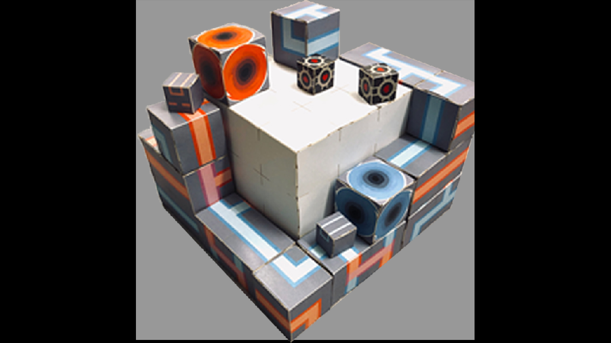
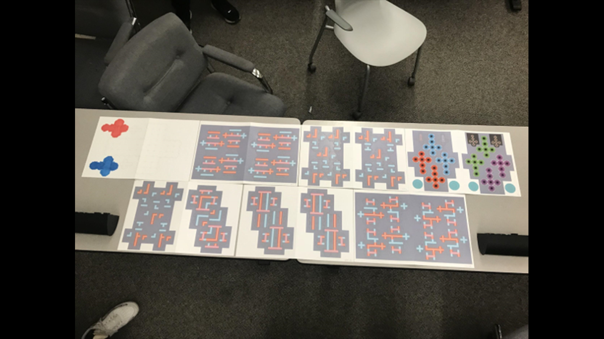

## Paper Portal

 - Genre: Collaborative Board Game

 - Team Size: 4

 - Role: Lead Designer, Artist

 - [View Our Design Document](https://www.dropbox.com/s/8zszixmjl11b2n2/PaperPortalDesignDocument.docx?dl=0)

This is a board game project made for a "Papering the Digital" challenge. With the digital template the game can be produced with a printer and lazer cutter. The game is also flat packable in envolopes.

As the designer I led the team through the whole design process: Brainstorming, Ideation, Prototyping, Playtesting and several Iterations. A detailed design document is available for this project. As the artist I made all the digital templates of the final version.

