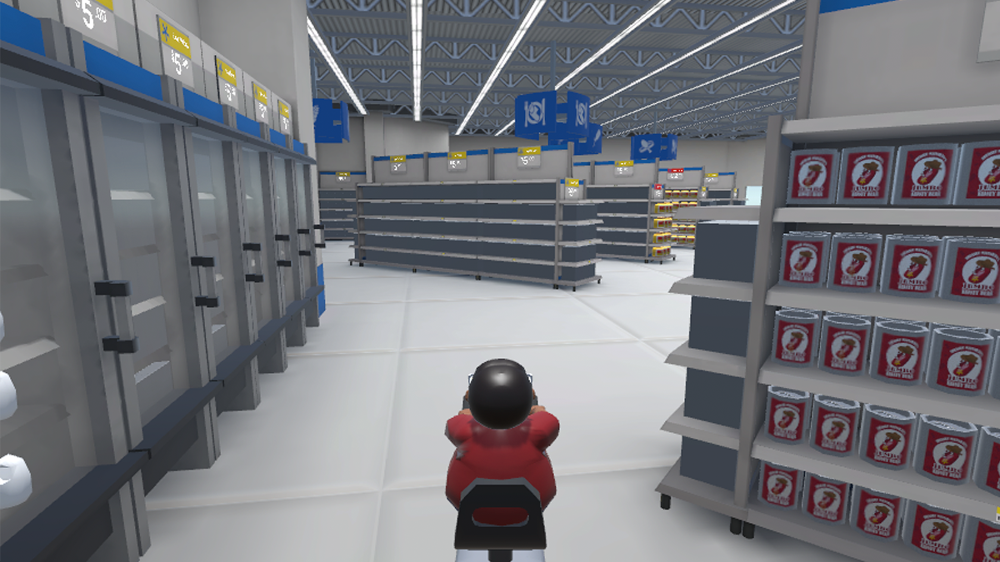
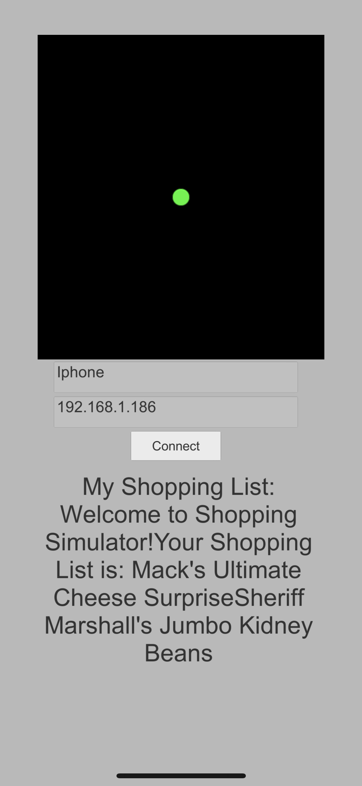

## Shopping Simulator (Ongoing)

 - 2020.1 - now

 - Genre: Split-screen Party Game

 - Team Size: 8 (Team of 3 Programmers, 2 Artists, 1 Manager, 1 Writer and 1 Musician)

 - Role: Designer, Networking Programmer

 - Unity

This is an ongoing project. Our goal is to have a split-screen multiplayer party game. And players can use their cellphones to connect to the game, to get their assigned shopping list and a mini map of products.

My main responsibility for this project is to design the gameplay around the cellphone and implement them using C# (.NET). Our target platform is Windows - Android / iOS.

Current Progress(2020.2.12): Cross-platform connection setup with TCP

