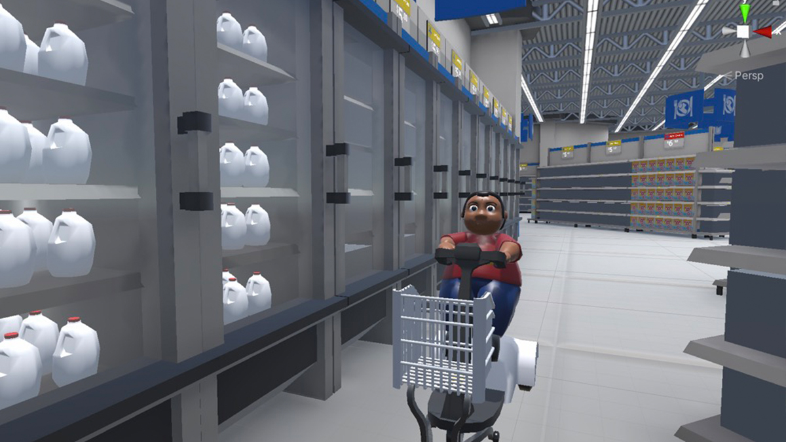

## Shopping Simulator (Ongoing)

 - 2020.1 - now

 - Genre: Split-screen Party Game

 - Team Size: 8 (Team of 3 Programmers, 2 Artists, 1 Manager, 1 Writer and 1 Musician)

 - Role: Designer, Programmer

 - Unity

This is an ongoing project. Our goal is to have a split-screen multiplayer party game. And players can use their cellphones to connect to the game, to get their assigned shopping list and a mini map of products.

My main responsibility for this project is to design the gameplay around the cellphone and implement them using C# (.NET). Our target platform is Windows - Android / iOS.

Our Original Pitch:

Overview : Compete with your friends to see who can shop the fastest. The first to check out wins in this fast paced four player competitive split-screen battle for the bags.

Gameplay and main feature : Use your SmartShopper GPS to navigate to the items on your shopping list. Interact with store items to make the environment more precarious for your opponents, such as moving wet floor signs or leaving banana peels.  Avoid (or engage in) collisions, as a realistic physics system will result in toppled shopping carts and lost groceries.

Plot: The game takes place in an American based society plagued by obesity, due to processed foods being the only available diet. Resource diversity is at an all time low, and often times people compete for goods, as if every day were Black Friday. 

Character: Every player’s avatar is an overweight person in a motorized shopping cart. The character can pick up, move, and interact with items found in the store. 

Control: Typical vehicle controls, with acceleration, brakes, etc. Players can connect their phone to a website and enter a session unique code to view their shopping list and GPS navigator with privacy.

Current Progress:

2020.2.12: Cross-platform connection setup with TCP

