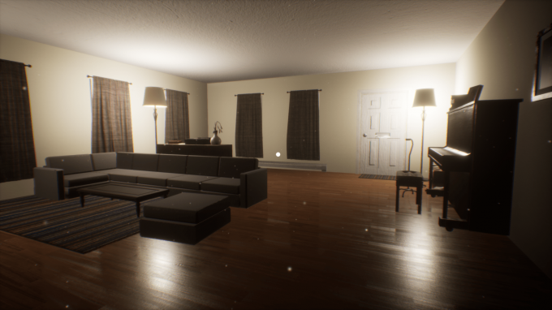

## Yet Another Day

 - 2019.11 - 2019.12

 - Genre: Interactive Storytelling Game

 - Team Size: 4

 - Role: Lead Designer, Lead Programmer, Animator

 - Unreal Engine 4

 - [Download on Windows](https://www.dropbox.com/s/nlok70w82nae0zj/YetAnotherDay.zip?dl=0)

 - [Download on MAC](https://www.dropbox.com/sh/gdl3tfpzzqe2opc/AAAWt61IcCq0a3NCIUaRvi48a?dl=0)

The game uses environmental storytelling to evoke emotional impact on players. 

As the lead designer, I designed all the gameplay and the narrative structure of the game. I also collaborated with the artist team to design and constructed the whole level of the game.

As the lead programmer, I developed major functionalities of the game with Unreal Blueprint and C++, I also constructed an in-engine pipeline for the artist team so that they can add custom interactions to their model by just tagging their model, like "inspect", "Pickup", etc.

Also did all the cut sceens and animations using Unreal Level Sequencer

